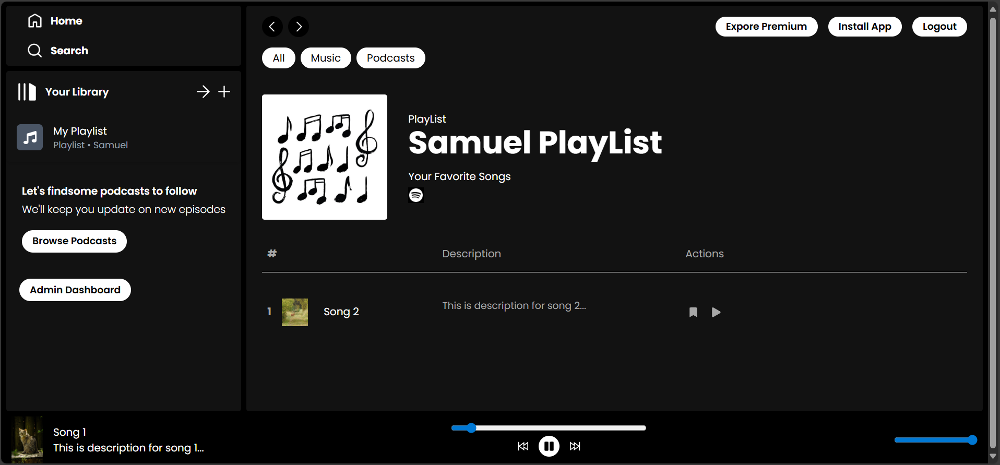
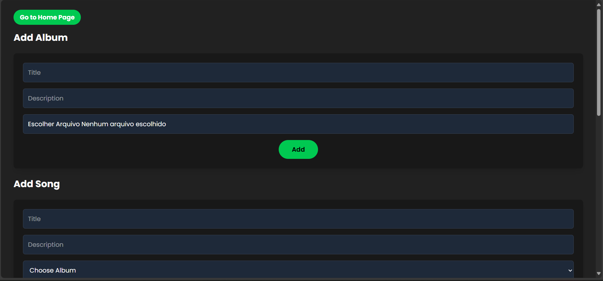
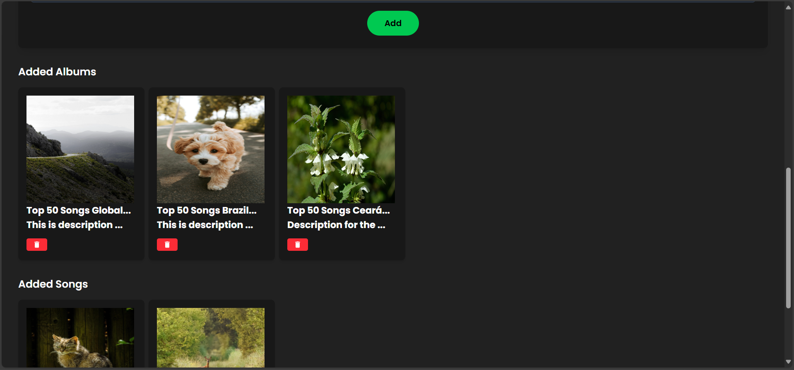
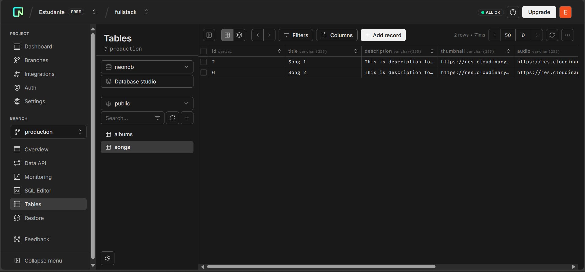
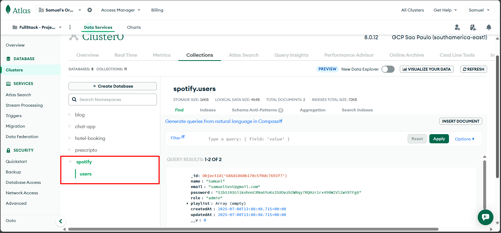
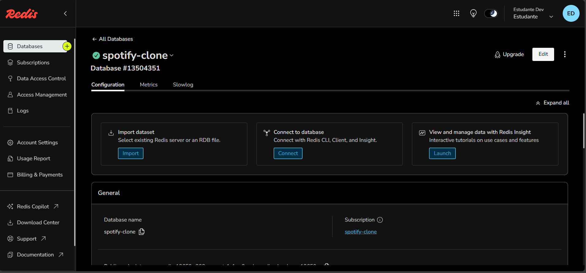
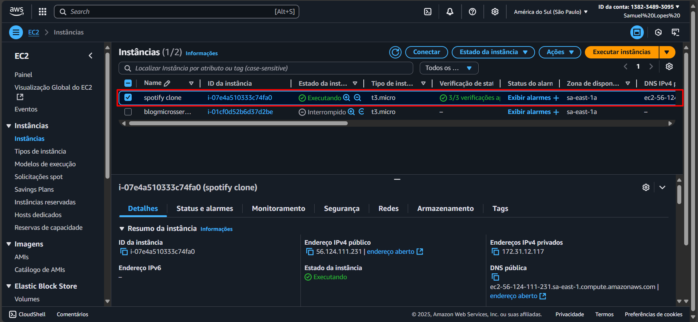
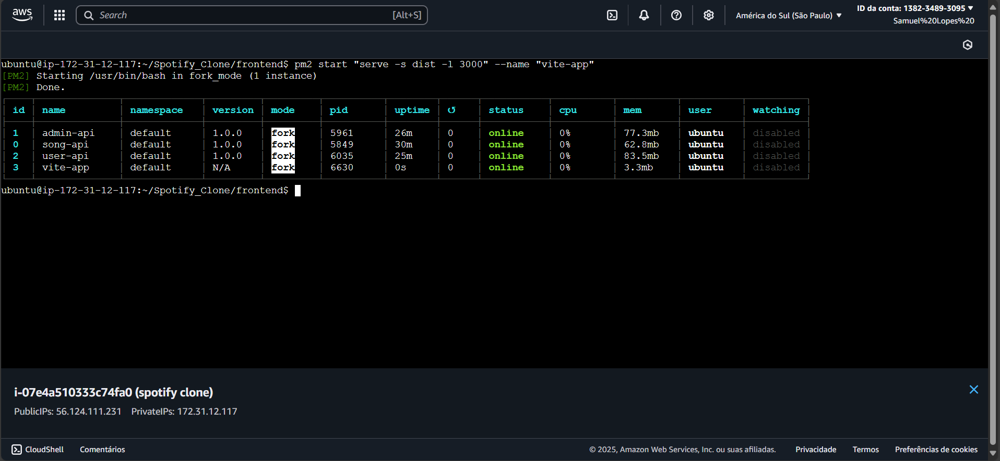

# Projeto Finalizado - 20/08/2025

## Descrição do Projeto:

Este projeto é uma aplicação web inspirada na plataforma Spotify, voltada para o streaming de músicas diretamente pelo navegador. A proposta é oferecer uma experiência semelhante à do serviço original, permitindo que os usuários escutem faixas de áudio de forma prática e intuitiva.

A aplicação contempla dois tipos de usuários:

- Administrador (Admin): possui acesso a funcionalidades de gerenciamento, como cadastro, edição e exclusão de músicas e álbuns (playlists). Também pode atualizar informações como thumbnails e metadados das faixas.
- Usuário Comum: pode criar suas próprias playlists personalizadas com músicas favoritas, escutá-las diretamente na plataforma e navegar pelo catálogo disponível.

O sistema foi desenvolvido com foco em usabilidade, organização de conteúdo musical e controle de acesso por tipo de usuário, simulando uma estrutura real de plataforma de streaming.

## Tecnologias Utilizadas:

- ReactJS com Vite e TypeScript (Front-end)
  - React Router DOM (Navegação)
  - React Hooks useState, useEffect, useContext (Gerenciamento de Estado)
  - React Hook useCallback (Gerenciamento de Funções - Memorizar)
  - React Hook useRef (Manipulação de Elementos)
  - React-Toastify (Notificações)
  - React-Icons (Biblioteca de Ícones)
  - Axios (Requisições HTTP)
  - TailwindCSS (Estilização)
- NodeJS com Express e TypeScript (Back-end)
  - Dividido em Microsserviços: User-Service, Song-Service e Admin-Service
  - Bcrypt (Criptografia)
  - CORS (Gerenciar Acesso a API)
  - JsonWebToken - JWT (Gerenciamento de Tokens)
  - Multer e DataURI (Manipulação de Arquivos)
  - Axios (Requisições HTTP)
  - Concurrently e Nodemon (Gerenciar Execução da Aplicação)
  - Cloudinary (Cloud de Arquivos)
  - Mongoose (ORM para NoSQL - MongoDB)
- NeonDB (PostgreSQL), MongoDB (NoSQL) e Redis (NoSQL) [Banco de Dados]

**Deploy da Aplicação na AWS**: [Spotify_Clone](http://56.124.111.231:3000)

## Imagens do Projeto:

### Home da Aplicação:

### Tela com PlayList Criada:

### Tela de Dashboard para Gerenciamento do Admin:

### Bancos de Dados Utilizados no Projeto:

Database Neon é uma plataforma serverless baseada em PostgreSQL.

MongoDB Atlas é uma plataforma de banco de dados como serviço (DBaaS).

Redis é uma plataforma de banco de dados em memória, NoSQL e de código aberto.

### Deploy na AWS da Aplicação:

Uma instância do EC2 (Máquina Virtual) para Deploy da Aplicação.

Todos os Serviços da Aplicação em Execução, Incluindo o Frontend na Máquina Virtual.

Créditos para **Small Town Coder**: [Link do Vídeo da Aplicação](https://www.youtube.com/watch?v=b378aOTrVo0)
