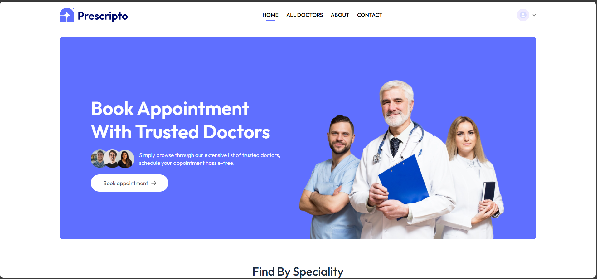
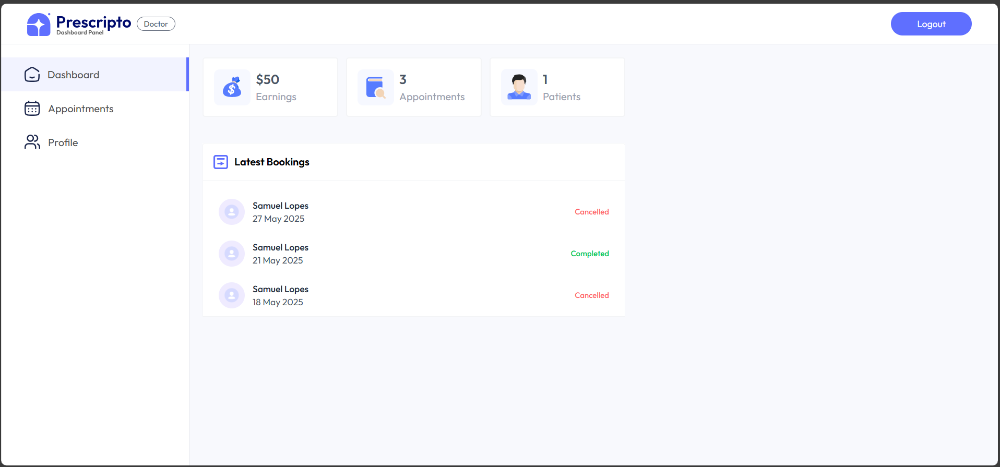
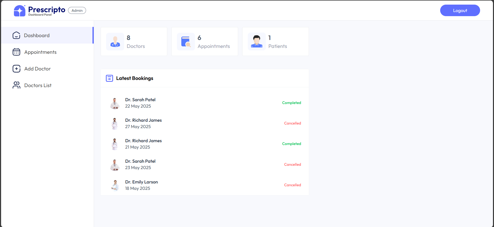

# Projeto Finalizado - 22/05/2025

## Descrição do Projeto:

O projeto consiste em um sistema de agendamento de consultas médicas, onde os pacientes podem agendar consultas com médicos especializados em diversas áreas médicas. O sistema permite que os pacientes escolham a data, horário e médico desejados, e também permite que os médicos visualizem suas próprias agendas e os horários disponíveis. Além de contar com uma área administrativa para gerenciar os médicos, pacientes e consultas.

## Tecnologias Utilizadas:

- ReactJS (Front-end)
  - React Router (Navegação)
  - Axios (Requisições HTTP)
  - React Hook UseState, UseEffect, UseContext (Gerenciamento de Estado)
- NodeJS com Express (Back-end)
  - JWT (Autenticação)
  - Bcrypt (Criptografia)
  - Multer (Upload de Arquivos)
  - Mongoose (Conexão com o Banco de Dados)
- MongoDB (Banco de Dados)

## Imagens do Projeto:

### Home da Aplicação:

### Home para Doctor:

### Home para Admin:

Créditos para **Greatstack**:

- [Link do Vídeo da Aplicação](https://www.youtube.com/watch?v=eRTTlS0zaW8)
