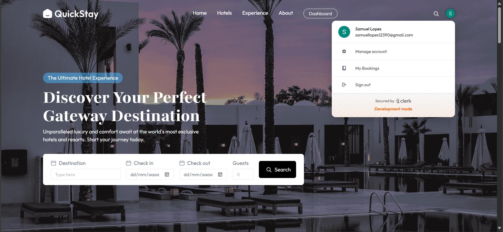
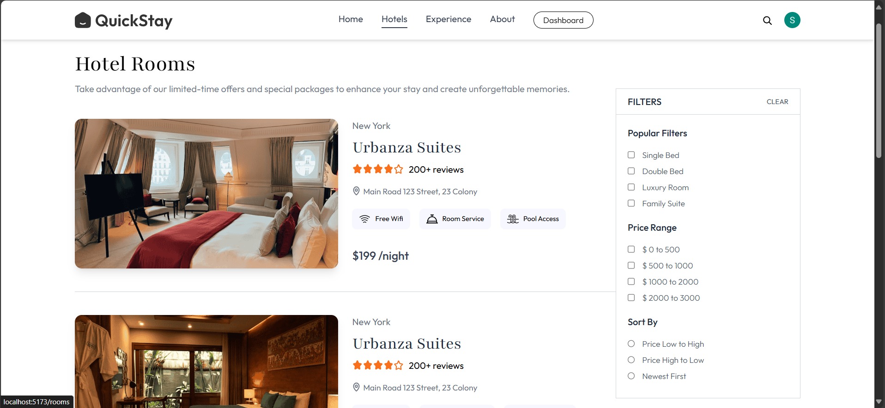
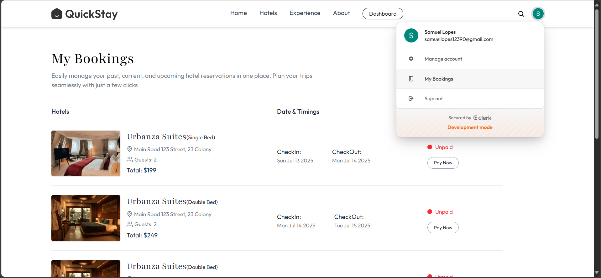
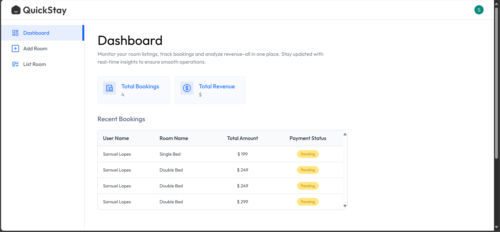

# Projeto Finalizado - 02/07/2025

## Descrição do Projeto:

O projeto consiste em uma aplicação web voltada para o agendamento de quartos de hotéis, proporcionando ao usuário uma experiência intuitiva e eficiente. A plataforma permite que o usuário realize login ou cadastro, garantindo acesso às funcionalidades de reserva.

Além da área destinada ao público geral, a aplicação conta com uma seção administrativa, onde é possível cadastrar novos hotéis ou remover estabelecimentos existentes, oferecendo total controle ao administrador.

Após efetuar uma reserva, o usuário pode visualizar e acompanhar seus agendamentos por meio de uma página dedicada, que exibe detalhes completos de cada reserva. Para confirmar o agendamento, é necessário realizar o pagamento, utilizando os dados previamente informados do cartão de crédito.

## Tecnologias Utilizadas:

- ReactJS (Front-end)
  - React Router DOM (Navegação)
  - React Hooks UseState, UseEffect, UseContext (Gerenciamento de Estado)
  - React Hook useRef (Manipulação de Elementos)
  - React-Hot-Toastify (Notificações)
  - Axios (Requisições HTTP)
  - Clerk (Ferramenta de Autenticação)
  - Stripe (Gateway de Pagamento)
  - Tailwind CSS (Estilização)
- NodeJS com Express (Back-end)
  - Bcrypt (Criptografia)
  - CORS (Gerenciar Acesso a API)
  - Multer (Upload de Arquivos)
  - NodeMailer (Ferramenta para Emails)
  - SVIX (Ferramenta para Webhooks)
  - Mongoose (ORM com MongoDB - NoSQL)
  - Cloudinary (Cloud de Arquivos)
  - Clerk (Ferramenta de Autenticação)
  - Stripe (Gateway de Pagamento)
- MongoDB (Banco de Dados)

**Deploy da Aplicação na Vercel**: [Hotel-Booking](https://quickstay-mu-ten.vercel.app/)

## Imagens do Projeto:

### Home da Aplicação:

### Tela de Hotéis da Aplicação:

### Tela de Meus Agendamentos:

### Tela de Dashboard (Admin):

Créditos para **Greatstack**: [Link do Vídeo da Aplicação](https://www.youtube.com/watch?v=ubM9cX8G_gk)
