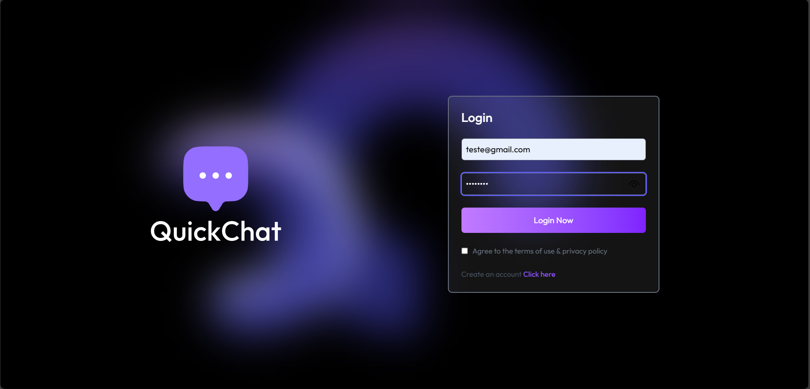
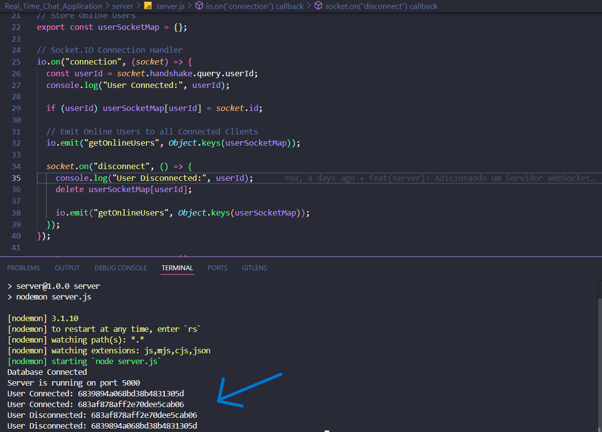
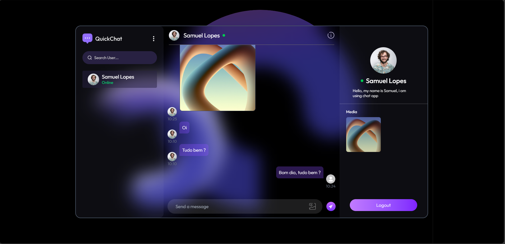
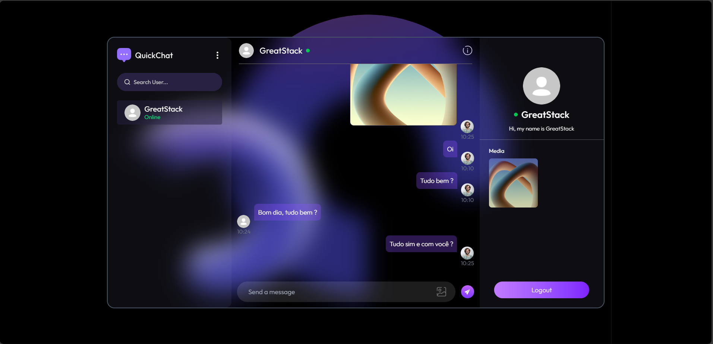
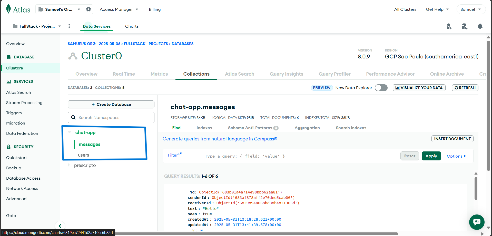

# Projeto Finalizado - 31/05/2025

## Descrição do Projeto:

Essa aplicação web oferece comunicação em tempo real, permitindo que os usuários se conectem instantaneamente para trocar mensagens e compartilhar arquivos. Para garantir a segurança dos dados, implementamos mecanismos de autenticação e autorização. A tecnologia por trás da comunicação em tempo real é o Socket.io, que gerencia eventos de forma eficiente, possibilitando a interação dinâmica entre usuários online e o fluxo contínuo de mensagens.

## Tecnologias Utilizadas:

- ReactJS (Front-end)
  - React Router (Navegação)
  - React Hook useNavigate (Navegação)
  - React Hooks UseState, UseEffect, UseContext (Gerenciamento de Estado)
  - React Hook useRef (Manipulação de Elementos)
  - React-Toastify (Notificações)
  - Axios (Requisições HTTP)
  - Socket.io-Client (Comunicação em Tempo Real)
  - Tailwind CSS (Estilização)
- NodeJS com Express (Back-end)
  - JWT (Autenticação)
  - Bcrypt (Criptografia)
  - Mongoose (Conexão com o Banco de Dados)
  - Cloudinary (Upload de Imagens)
  - Socket.io (Comunicação em Tempo Real)
- MongoDB (Banco de Dados) - Atlas

## Imagens do Projeto:

### Tela de Login para Usuários:

### Visibilidade das Conexões no Servidor do Usuário:

### Troca de Mensagens entre Usuários em Tempo Real:

### MongoDB Atlas com Database e Collections:

Créditos para **Greatstack**:

- [Link do Vídeo da Aplicação](https://www.youtube.com/watch?v=tTCam8KGVRE&t=6742s)
