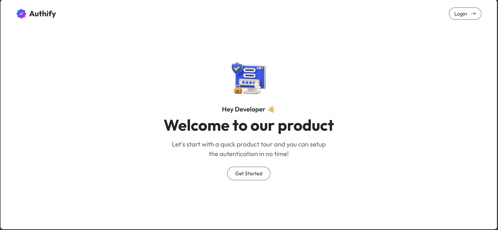
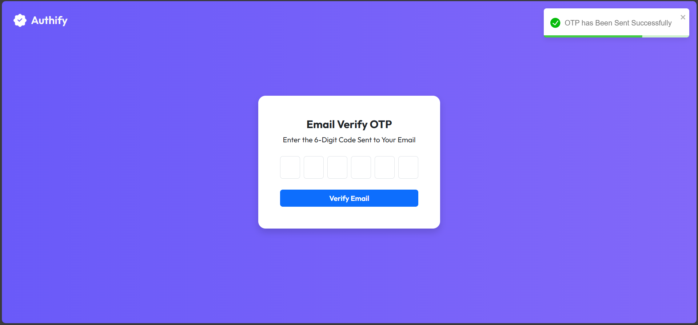
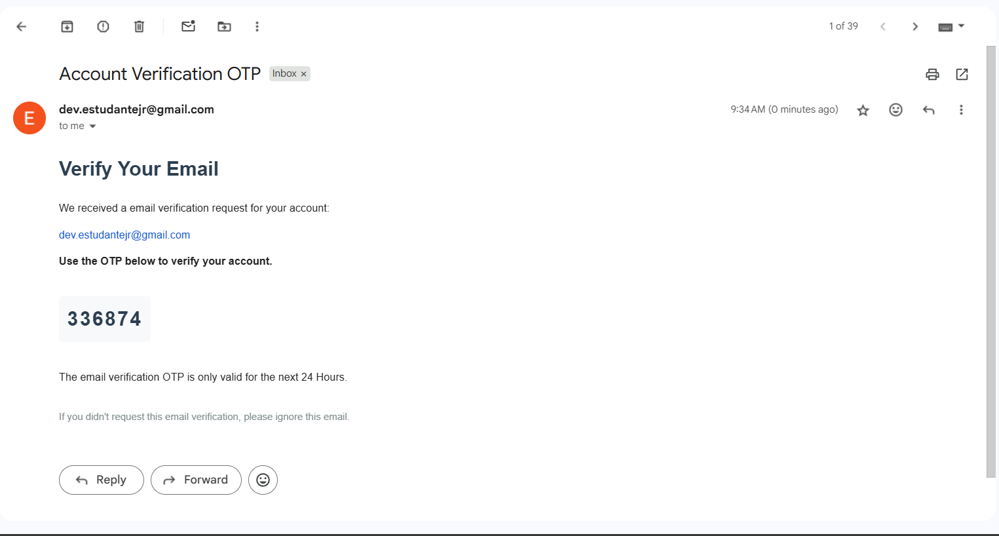
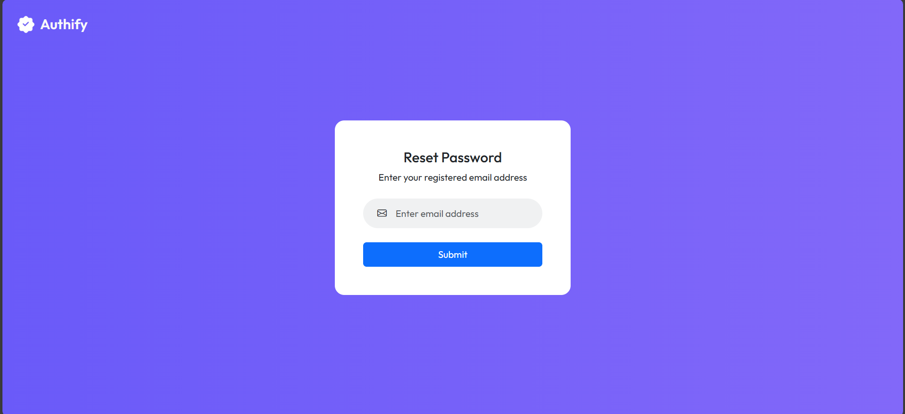
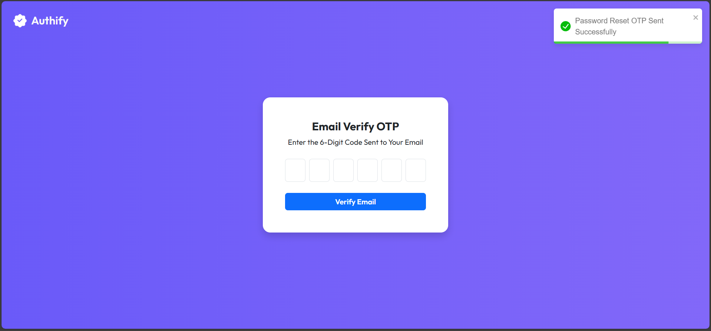
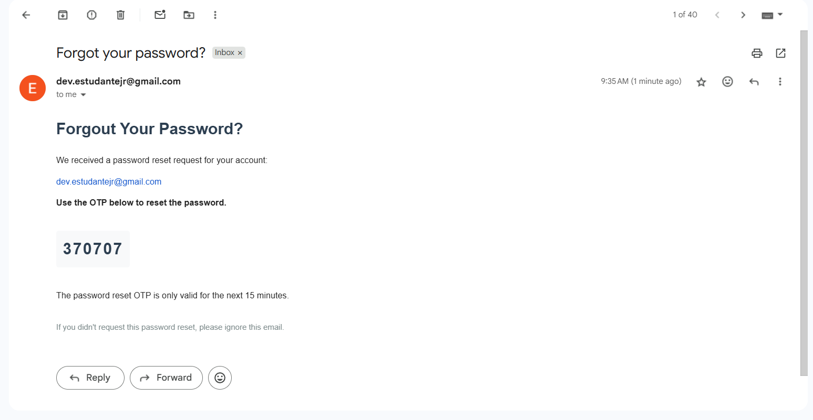

# Projeto Finalizado - 17/07/2025

## Descrição do Projeto:

Este projeto trata-se de uma aplicação web desenvolvida para realizar a autenticação de usuários por meio de um sistema baseado em códigos OTP (One-Time Password). Durante o processo de registro, o usuário fornece seu nome, e-mail e senha, e em seguida recebe um código OTP por e-mail, o qual deve ser inserido para confirmar o cadastro ou login na conta.

Além disso, a aplicação permite que o usuário valide sua conta posteriormente, solicitando um novo código OTP por e-mail para completar o processo de verificação.

## Tecnologias Utilizadas:

- ReactJS (Front-end)
  - React Router DOM (Navegação)
  - React Hooks UseState, UseEffect, UseContext (Gerenciamento de Estado)
  - React Hook useRef (Manipulação de Elementos)
  - React-Toastify (Notificações)
  - Axios (Requisições HTTP)
  - Bootstrap (Estilização)
- Java com Spring Boot (Back-end)
  - Bcrypt (Criptografia)
  - CORS (Gerenciar Acesso a API)
  - JavaMailSender (Ferramenta para Emails)
  - SpringDataJPA (Ferramenta para Banco de Dados)
  - SpringSecurity (Ferramenta de Autenticação)
  - Lombok (Módulo de Anotações - Produtividade)
  - Thymeleaf (Templates para HTML)
  - Token JWT e Cookies (Objetos de Autenticação)
- MySQL com Docker (Banco de Dados)

## Imagens do Projeto:

### Home da Aplicação:

### Tela com Código OTP para Verificar Conta:

Código OTP no Email para Realizar a Verificação da Conta.

### Tela para Resetar a Senha da Conta:

### Tela com Código OTP para Resetar Senha:

Código OTP no Email para Realizar o Reset da Senha.

Créditos para **Engineer Talks With Bushan**: [Link do Vídeo da Aplicação](https://www.youtube.com/watch?v=ewGbjpFmRbw)
